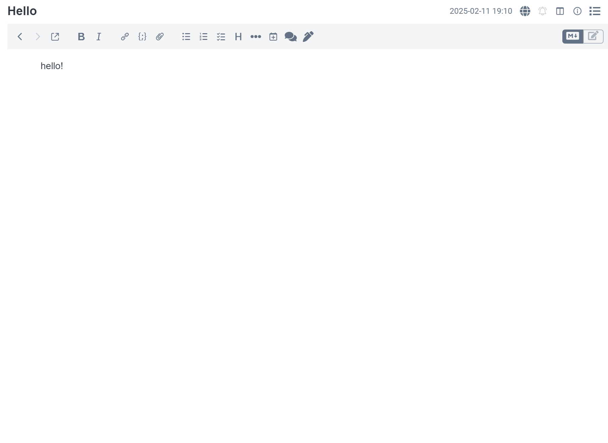
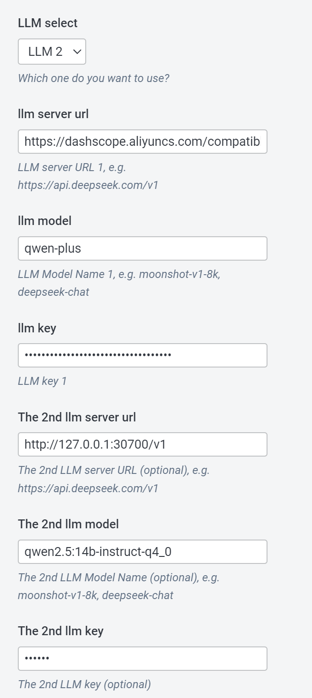
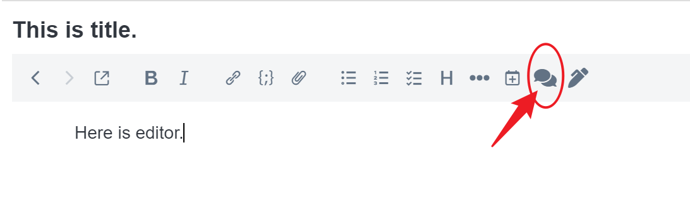
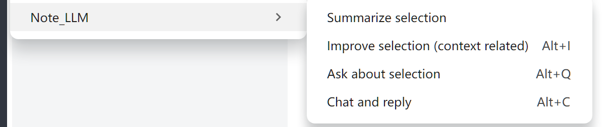

# Joplin Plugin: NoteLLM

To be your very own AI-powered note plugin for Joplin. It's completely open-source and does not collect any logs or personal information.

## Features

- **Customizable LLM Service Source**: Configure the source of your Large Language Model (LLM) service, including options like `openai`, `deepseek`, `qwen`, or even a local LLM server that is compatible with `openai-api`. Configuration requires specifying a URL, API key, and model name.
- **Summarization**: Summarize selected text portions efficiently. If not selected, LLM will summarize all above cursor.
- **Text Optimization**: Improve the expression of selected text by considering its context (before and after). 
- **Question & Answer**: Generate answers to questions based on selected text. 
- **Improve your selection**: Improve your selection based on text before and after. 
- **Chat**: Engage in conversations with AI based on all preceding content up to your cursor position, providing real-time assistance for writing. Ignore text after cursor.

## Mobile Support

Currently, mobile users can enjoy the chat functionality over the entire note text. 

Others functions are under development.

## Usage Instructions

**This plugin can only work in markdown editor!!!!**

**This plugin can only work in markdown editor!!!!**

**This plugin can only work in markdown editor!!!!**

After installing this plugin, you should go to settings to configure your ai options. At least input one URL, API key, and model name.

You can configure two LLMs and switch between them.

Then you will have access to several features. First, a chat icon appears at the top of the markdown editing interface. Clicking on it triggers a conversation with AI based on all preceding content up to your cursor position.

And, in the top menu under Tools / NoteLLM, find quick access to all functions. Some have shortcut keys for easy invocation.

## UPDATE LOGS

- v0.4.5, 2025-03-09. Bug fixed.
- v0.4.4, 2025-03-08. Add dialogs for ask and improve.
- v0.4.3, 2025-03-07. Multi-language (Simplified Chinese) supported.
- v0.4.2, 2025-03-06. LLMs can change by menu.
- v0.4.0, 2025-02-25. Better support for mobile.

## Thank you

NoteLLM is designed to enhance your note-taking experience with powerful AI capabilities while ensuring privacy and customization.