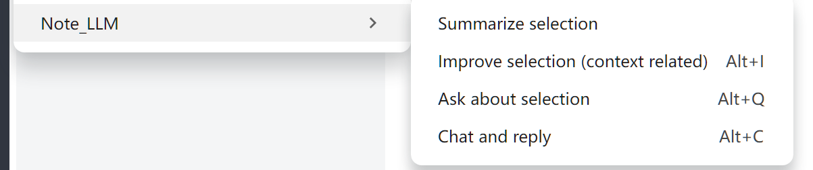

# Joplin 插件：NoteLLM

这款插件可以让你在开源笔记软件 Joplin 中自由使用 AI 功能。

完全开源，而且绝不收集任何日志或个人信息。

最新重要升级：支持 MCP。

# 功能

- **可定制的 LLM 服务源**：
    - 配置您的大型语言模型（LLM）服务的源，包括 `openai`、`deepseek`、`qwen`，甚至是与 `openai-api` 兼容的本地 LLM 服务器，例如 ollama。配置需要指定 URL、API 密钥和模型名称。
    - 您可以在下面的“使用说明”部分找到示例。
- **聊天**：
    - **如果没有选择**：与 LLM 进行文本聊天 **在光标上方的所有文本中**。光标后面的所有文本将 **不** 被发送到 LLM。
    - **如果选择了任何文本**：只有选定的文本会被发送。
    - 新功能：“高级聊天模式”。将文本分割成 {"role":"user","content":"xxx"} 的形式。
- **摘要**：
    - **如果没有选择**：对 **光标上方的所有文本** 进行摘要。
    - **如果选择了任何文本**：有效地对选定的文本部分进行摘要。
- **重写您的选择**：
    - 重写选定的文本。这将考虑选择前后的上下文。
    - 您可以告诉 LLM 如何重写。
- **问答**：
    - 向 LLM 询问选定文本。
- **支持 MCP**：
    - 您可以在笔记中使用可流式传输的 HTTP MCP 工具。

## 移动端

目前，Android 用户可以在整个笔记文本中享受聊天功能。iOS 因为 Joplin 不能安装非官方插件，暂无法使用。

其他功能正在开发中。

**移动端已知问题**：

- 在移动端 Joplin 上，由于 **CORS 限制**，某些 LLM 服务器可能无法正常工作。已知 ollama 和 MCP 在移动设备上存在此问题；您可以尝试配置代理解决此问题。这是 **Joplin 框架的限制**，我现在无法修复。
- 有时，当您点击插件图标时没有响应。终止应用的后台进程并重启应用通常可以解决此问题。原因可能与 Joplin 的后台管理有关，但我目前无法准确确定问题。

# 使用说明

**此插件只能在 markdown 编辑器中使用!!!!**

**此插件只能在 markdown 编辑器中使用!!!!**

**此插件只能在 markdown 编辑器中使用!!!!**

安装此插件后，您应该进入设置以配置您的 AI 选项。至少输入一个 URL、API 密钥和模型名称。

您可以配置最多 3 个 LLM，并在它们之间切换。

## 一些设置示例

目前，此插件支持 OpenAI-API（包括 OpenAI 兼容的 API）。感谢 [Ian Channing](https://github.com/ianchanning)。

| 示例 | LLM 服务器 URL | LLM 模型名称（示例） |
| :----------------------------------------- | :--------------------------------------- | ------------------------------------------ |
| OpenAI | `https://api.openai.com/v1` | `o3` |
| Claude | `https://api.anthropic.com/v1` | `claude-3-7-sonnet-20250219` |
| Deepseek | `https://api.deepseek.com/v1` | `deepseek-chat` 或 `deepseek-reasoner` |
| Qwen | `https://dashscope.aliyuncs.com/compatible-mode/v1` | `qwen-plus` |
| Google Gemini | `https://generativelanguage.googleapis.com/v1beta` | `gemini-2.0-flash` |
| OpenRouter | `https://openrouter.ai/api/v1` | `google/gemini-2.5-flash` |
| volcengine | `https://ark.cn-beijing.volces.com/api/v3` | `doubao-1.5-pro-32k` |
| ollama（本地） | `http://your_id:your_port/v1` | `(YOUR_MODEL_NAME)` |

**提醒**：我测试了 qwen、deepseek、volcengine 和 ollama。如果您发现错误，请告诉我。谢谢。

然后，您将能够访问多个功能。首先，聊天图标会出现在 markdown 编辑界面的顶部。点击它将基于您光标位置之前的所有内容触发与 AI 的对话。

您还可以通过再次点击此按钮停止生成（>= v0.6.1）。

并且，在工具/NoteLLM 的顶部菜单中，快速访问所有功能。一些功能有快捷键，以方便调用。

## MCP 支持！！！

MCP 功能已经完全升级和重构，现在直接支持可流式传输的 HTTP MCP。

在 v0.7.0 或更高版本中，MCP 设置可以在“NoteLLM MCP”会话中找到。在此，您最多可以配置 42 个 MCP 服务器，并根据需要切换它们。

在这里，您可以添加可流式传输的 HTTP MCP 服务器。

将 “MCP for LLM (preview)” 从 “OFF” 更改为 LLM1、LLM2 和 LLM3 下的 “MCP (tool call)” 后，您现在可以在笔记中使用 MCP 工具。

**提醒：LLM 必须支持 “tool call”**。

**提醒**：目前不支持 STDIO 和 SSE，但您可以使用其他工具，如“Local_MCP_Manager”将其加载，并转换为可流式传输的 HTTP 模式进行调用。详细信息，请参见 https://github.com/horsesword/local_mcp_manager

# 更新日志

- v0.7.4, 2025-12-02。修复了屏幕自动滚动期间的参数错误。
- v0.7.3，2025-09-30。修复了调用 Google Gemini 的错误。
- v0.7.2，2025-09-27。新功能：通过菜单切换模型后自动检查可用性。
- v0.7.1，2025-09-13。改进 MCP 调用提示。
- v0.7.0，2025-09-09。MCP 功能已经完全升级和重构，现在直接支持可流式传输的 HTTP MCP。
- v0.6.2，2025-08-04。（1）修复动画错误。（2）新增“停止”按钮以停止 LLM 的生成。
- v0.6.1（预览），2025-08-04。（1）修复错误。（2）您可以通过再次点击“聊天”按钮中断AI输出。
- v0.6.0（预览），2025-08-03。MCP 可用。
- v0.5.2，2025-07-12。优化了等待和思考的动画效果。
- v0.5.1，2025-07-09。（1）优化了许多动画效果。（2）新增 toast 提示。
- v0.5.0，2025-07-08。显著调整了等待动画，并优化了代码逻辑。
- v0.4.16，2025-07-06。修复小错误。
- v0.4.15，2025-07-01。优化了一些动画效果。
- v0.4.14，2025-06-14。我们现在可以设置自己的聊天提示。
- v0.4.13，2025-05-25。（1）增加了等待动画。（2）修复错误：如果笔记意外更改则停止运行。
- v0.4.12，2025-05-17。（1）我们可以现在隐藏 `<think>` 和 `</think>` 之间的上下文。（2）在生成期间保持光标位置，以避免因光标移动而造成的文本输入位置错误。
- v0.4.11，2025-05-04。新增 promo_tile。
- v0.4.10，2025-05-04。新的高级聊天模式。基于聊天特征优化之前文本的解析，包括拆分对话角色、跳过推理模型的“思考”部分，以及其他功能。
- v0.4.9，2025-04-15。改进了“聊天”和“摘要”的提示。感谢 [Adam Outler](https://github.com/adamoutler)。并且，删除了无用的旧文件。
- v0.4.8，2025-04-03。改进了提示，以修复导致非中文内容的响应为中文的错误。
- v0.4.7，2025-03-30。尝试修复 Claude API 的 CORS 问题。
- v0.4.6，2025-03-09。我们现在可以设置最多 3 个 LLM。
- v0.4.5，2025-03-09。修复错误。
- v0.4.4，2025-03-08。增加了“LLM 询问”和“LLM 改进”的对话框。
- v0.4.3，2025-03-07。支持多语言（简体中文）。
- v0.4.2，2025-03-06。LLM 可以通过工具菜单切换。
- v0.4.0，2025-02-25。更好地支持移动应用。

# 感谢！

NoteLLM 旨在通过强大的 AI 功能增强您的笔记体验，同时确保隐私和自定义。

# 许可证

该项目根据 AGPL-3.0 许可证获得许可 - 详细信息请参阅 [LICENSE](LICENSE) 文件。